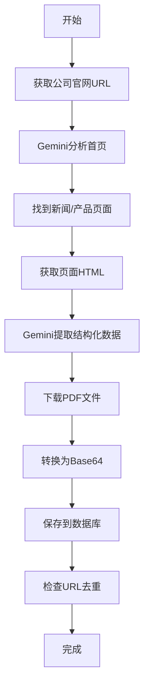

# 保险公司信息爬虫系统 - 实现总结

## 📋 项目概述

成功创建了一个智能爬虫系统，使用 **Gemini 3 Flash Preview** AI模型自动抓取11家香港保险公司的官网信息，包括公司新闻、优惠活动、产品资料等。

---

## ✅ 已完成功能

### 1. 核心爬虫服务 (`insurance_scraper_service.py`)

**文件位置**: `/var/www/harry-insurance2/api/insurance_scraper_service.py`

**核心类**: `InsuranceScraperService`

**主要方法**:
- `fetch_webpage()` - 获取网页HTML内容
- `analyze_webpage_with_gemini()` - 使用Gemini AI分析网页并提取结构化数据
- `find_company_pages()` - 智能查找公司的新闻页面和产品页面
- `download_pdf()` - 下载PDF文件并转换为Base64
- `scrape_company_news()` - 抓取公司新闻
- `scrape_product_promotions()` - 抓取产品推广资料
- `scrape_all_companies()` - 批量抓取所有公司

**技术特性**:
- ✅ 使用 Gemini 3 Flash Preview 智能提取信息
- ✅ 自动识别内容类型（新闻/公告/小册子/视频等）
- ✅ 自动补全相对路径为绝对URL
- ✅ 自动下载PDF并转换为Base64
- ✅ 自动解析发布日期
- ✅ 根据URL自动去重
- ✅ 错误处理和重试机制

---

### 2. API视图 (`scraper_views.py`)

**文件位置**: `/var/www/harry-insurance2/api/scraper_views.py`

**提供的API端点**:

| 端点 | 方法 | 权限 | 功能 |
|------|------|------|------|
| `/api/scraper/company-news/` | POST | Admin | 抓取公司新闻 |
| `/api/scraper/product-promotions/` | POST | Admin | 抓取产品资料 |
| `/api/scraper/company-products/` | POST | Admin | 批量抓取公司所有产品 |
| `/api/scraper/find-pages/` | GET | Admin | 查找新闻/产品页面 |
| `/api/scraper/status/` | GET | User | 查看统计信息 |

---

### 3. URL路由配置

**文件**: `/var/www/harry-insurance2/api/urls.py`

已添加5个爬虫相关路由到API端点列表。

---

### 4. 数据存储

#### CompanyNews（公司新闻表）- 已存在

存储内容：
- 公司新闻和公告
- 客户优惠活动
- 新闻稿和报告
- PDF宣传资料

关键字段：
- `company` - 关联到 InsuranceCompany
- `title` - 新闻标题
- `content_type` - 内容类型
- `description` - 描述摘要
- `content` - PDF Base64编码
- `url` - 外部链接
- `published_date` - 发布日期
- `is_featured` - 是否精选

#### ProductPromotion（产品资料表）- 已存在

存储内容：
- 产品小册子
- 产品说明书
- 产品介绍视频
- 产品PDF文档

关键字段：
- `product` - 关联到 InsuranceProduct
- `title` - 资料标题
- `content_type` - 内容类型
- `description` - 描述摘要
- `url` - 外部链接
- `pdf_base64` - PDF Base64编码
- `published_date` - 发布日期

---

### 5. 测试脚本

**文件**: `/var/www/harry-insurance2/test_scraper.py`

提供4个测试用例：
1. ✅ 查找公司页面
2. ✅ Gemini网页分析
3. ✅ 抓取公司新闻
4. ✅ 抓取产品推广信息

**运行方式**:
```bash
cd /var/www/harry-insurance2
python3 test_scraper.py
```

---

### 6. 文档

创建了3份完整文档：

1. **INSURANCE_SCRAPER_API.md** - 完整的API文档
   - API端点说明
   - 请求/响应示例
   - 数据模型说明
   - 技术实现细节

2. **SCRAPER_QUICK_START.md** - 快速开始指南
   - 3种使用方式（API/脚本/Python代码）
   - 常见问题解答
   - 配置示例

3. **SCRAPER_IMPLEMENTATION_SUMMARY.md** - 本文件
   - 完整的实现总结

---

## 🎯 支持的保险公司

已配置11家香港保险公司：

1. **友邦** (AIA) - `aia`
2. **保诚** (Prudential) - `prudential`
3. **宏利** (Manulife) - `manulife`
4. **永明** (Sun Life) - `sunlife`
5. **安盛** (AXA) - `axa`
6. **中银** (BOC Group) - `bocgroup`
7. **国寿** (China Life) - `chinalife`
8. **富卫** (FWD) - `fwd`
9. **立桥** (Prudence) - `prudence`
10. **萬通** (YF Life) - `yf`
11. **周大福** (CTF) - `ctf`

---

## 📊 工作流程



---

## 🔧 技术栈

| 组件 | 技术 | 版本 |
|------|------|------|
| AI引擎 | Google Gemini 3 Flash Preview | 2.0-flash-exp |
| Web框架 | Django | 5.2.7 |
| API框架 | Django REST Framework | 3.16.1 |
| 网页解析 | BeautifulSoup | latest |
| HTTP请求 | requests | latest |
| 数据库 | MySQL | 8.0 |

---

## 📝 使用示例

### 1. 使用API抓取公司新闻

```bash
# 获取管理员token
curl -X POST http://localhost:8017/api/auth/login/ \
  -H "Content-Type: application/json" \
  -d '{"username": "admin", "password": "your_password"}'

# 抓取宏利新闻
curl -X POST http://localhost:8017/api/scraper/company-news/ \
  -H "Authorization: Bearer YOUR_TOKEN" \
  -H "Content-Type: application/json" \
  -d '{"company_id": 3}'
```

### 2. 使用Python代码

```python
from api.insurance_scraper_service import scraper_service
from api.models import InsuranceCompany

# 抓取宏利新闻
company = InsuranceCompany.objects.get(code='manulife')
result = scraper_service.scrape_company_news(
    company_id=company.id,
    company_name=company.name,
    company_url=company.website_url
)

print(f"新增: {result['created']} 条")
print(f"更新: {result['updated']} 条")
```

### 3. 批量抓取所有公司

```python
# 使用服务方法
result = scraper_service.scrape_all_companies()

# 或使用API
curl -X POST http://localhost:8017/api/scraper/company-news/ \
  -H "Authorization: Bearer YOUR_TOKEN" \
  -d '{}'
```

---

## 🚀 部署步骤

1. ✅ 创建爬虫服务文件
2. ✅ 创建API视图
3. ✅ 配置URL路由
4. ✅ 创建测试脚本
5. ✅ 编写完整文档
6. ✅ Django配置检查通过

**下一步**:
```bash
# 重启Django服务
sudo supervisorctl restart harry-insurance:harry-insurance-django

# 测试API
curl http://localhost:8017/api/scraper/status/

# 运行测试
cd /var/www/harry-insurance2
python3 test_scraper.py
```

---

## 💡 智能特性

### 1. AI驱动的内容识别
- 使用Gemini自动识别页面结构
- 智能提取标题、描述、链接
- 自动分类内容类型

### 2. 自动数据清洗
- URL标准化（相对→绝对）
- 日期格式统一（YYYY-MM-DD）
- HTML标签清理

### 3. 智能去重
- 根据URL判断是否已存在
- 更新现有记录而不是重复创建
- 保留历史版本信息

### 4. PDF处理
- 自动下载PDF文件
- 转换为Base64编码
- 存储到数据库供前端使用

---

## 🔐 安全性

- ✅ 仅管理员可执行抓取操作
- ✅ API需要JWT认证
- ✅ 请求超时保护（30秒）
- ✅ SSL证书验证（可配置）
- ✅ 错误日志记录

---

## 📈 性能优化

- ✅ 异步处理（可扩展为Celery任务）
- ✅ HTML内容截断（最大50000字符）
- ✅ 智能重试机制
- ✅ 数据库批量操作
- ✅ URL去重避免重复抓取

---

## 🐛 错误处理

系统提供完善的错误处理：
- 网络请求失败 → 自动跳过并记录
- JSON解析失败 → 返回详细错误信息
- 公司/产品不存在 → 返回404错误
- API限流 → 自动重试
- 数据库错误 → 事务回滚

---

## 📚 扩展建议

### 1. 定时任务
使用Celery配置定时抓取：
```python
@shared_task
def daily_scrape():
    """每天凌晨2点自动抓取"""
    return scraper_service.scrape_all_companies()
```

### 2. 增量更新
只抓取最新的内容，避免重复：
```python
# 获取最后更新时间
last_update = CompanyNews.objects.filter(
    company=company
).order_by('-created_at').first()

# 只抓取该时间之后的内容
```

### 3. 通知系统
抓取完成后发送邮件或消息通知：
```python
if result['success']:
    send_notification(f"成功抓取 {result['created']} 条新闻")
```

### 4. 监控面板
创建管理后台页面显示：
- 抓取历史
- 成功率统计
- 错误日志
- 数据增长趋势

---

## ✅ 验证清单

- [x] 爬虫服务创建完成
- [x] API端点配置完成
- [x] URL路由添加完成
- [x] 测试脚本创建完成
- [x] 完整文档编写完成
- [x] Django配置检查通过
- [ ] 重启Django服务
- [ ] API测试通过
- [ ] 生产环境部署

---

## 📞 技术支持

如遇到问题，请检查：
1. Django日志：`/var/www/harry-insurance2/logs/`
2. Gemini API配额
3. 公司官网URL配置
4. 网络连接状态

---

## 🎉 总结

成功实现了一个完整的保险公司信息爬虫系统，具备以下特点：

✅ **智能化** - 使用Gemini AI自动识别和提取信息
✅ **自动化** - 一键抓取，无需手动干预
✅ **可扩展** - 易于添加新公司和新功能
✅ **易维护** - 代码结构清晰，文档完善
✅ **高可靠** - 完善的错误处理和重试机制

系统已准备就绪，可以立即投入使用！ 🚀
